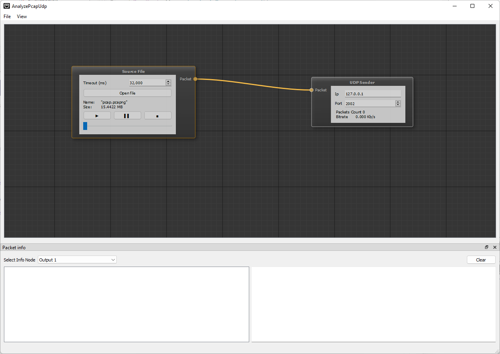
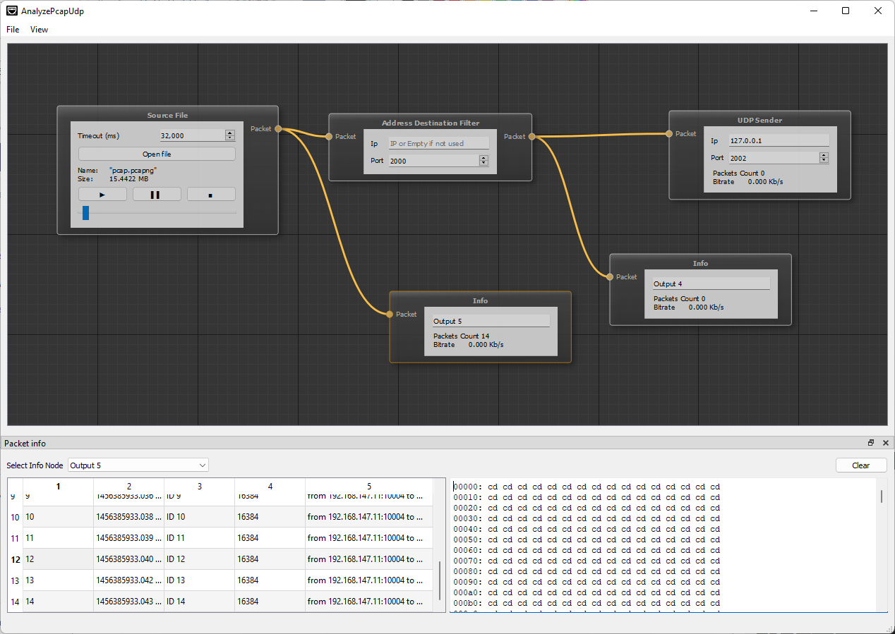

# AnalyzePcapUdp

Analyze pcap/pcapng files and sending udp packets to choose ports

# How To Use

- Add Node "Source File"
  - Select File(pcap or pcapng)
  - Select Timeout for send packets
- Add Node "UDP Sender"
  - Select IP and Port for destination
- Add Connection between them
- Play

    

You can add some filter and output nodes to control process:
- Info Node - statistic
- A filter by ip and port of a packet

    

